# TagScribeR


**TagScribeR** is a local, GPU-accelerated studio for building AI training datasets and training LoRAs on them. Browse and filter thousands of images, caption them with current vision-language models or booru taggers, fix and clean them, then train, all in one app.

It runs natively on **AMD Radeon (ROCm, Windows and Linux)** and **NVIDIA (CUDA)**, with a CPU fallback. Nothing leaves your machine unless you point it at an API yourself.

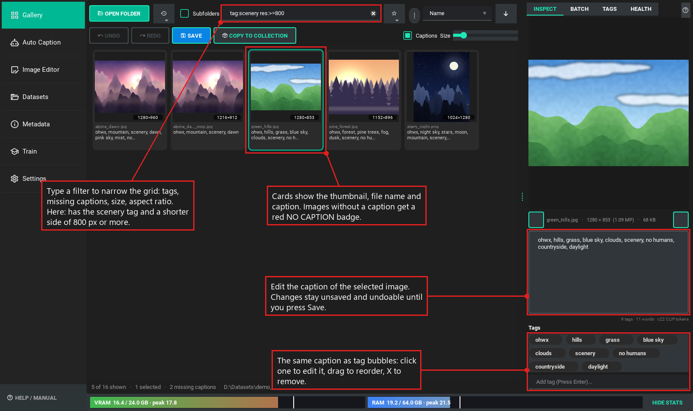

---

## Contents

- [Features](#-features)
- [Installation](#-installation): [AMD Radeon](#amd-radeon-rocm) · [NVIDIA](#nvidia-cuda) · [Linux](#linux) · [No GPU](#no-gpu)
- [Quick start](#-quick-start)
- [Training a LoRA](#-training-a-lora)
- [Your data is safe](#-your-data-is-safe)
- [Troubleshooting](#-troubleshooting)
- [Credits and licence](#-credits-and-licence)

---

## ✨ Features

### Dataset workspace

One folder is open in every tab, so you can tag, caption, edit and train without reopening anything.

- **Fast grid** for thousands of images, with zoomable thumbnails (Ctrl + mouse wheel).
- **Search-style filters:** `tag:1girl -tag:blurry missing:caption res:<768`. Save filters per folder.
- **Batch editing:** add, remove, replace and reorder tags across a selection; tag statistics with rename and merge.
- **Undo and redo** for every caption change. Nothing is written until you save.

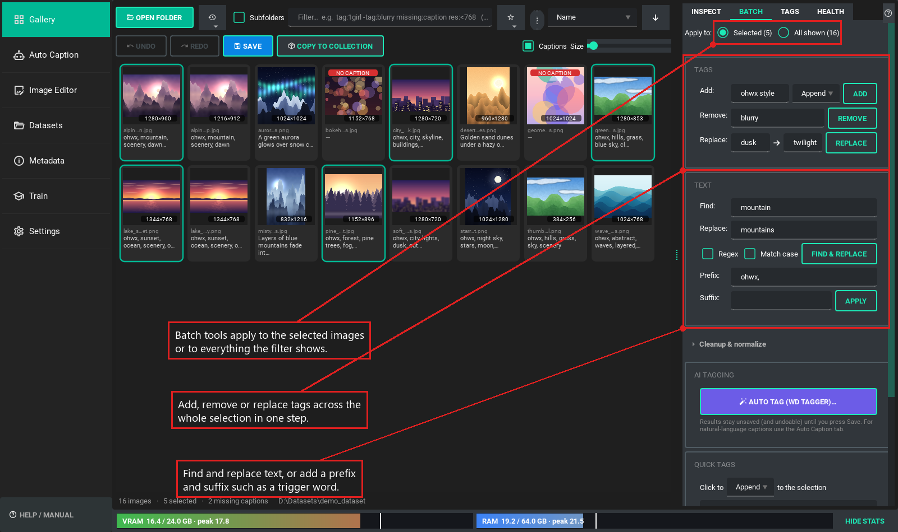

### Dataset health

Finds exact and near-duplicates, blurry and low-resolution images, and previews the aspect-ratio buckets for your training resolution.

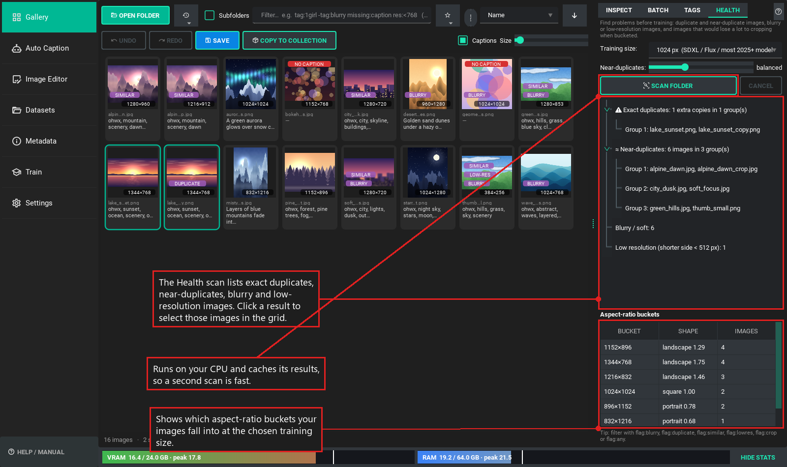

### AI captioning

- **Local vision models** through Hugging Face Transformers: Qwen3-VL, Qwen3.5, Gemma 4, JoyCaption and other image-text-to-text models.
- **Any OpenAI-compatible server:** LM Studio, llama.cpp, Ollama or a cloud API (use this for GGUF models).
- **WD auto-tagging:** SmilingWolf v3 taggers with thresholds, a blacklist and presets.
- **Recipes:** a subject or trigger word the model must use, and each image's existing tags passed as hints.
- **Review before applying:** a word-level diff of each AI caption against the current one; accept or reject per image.
- **Presets:** built-in instruction presets plus your own.

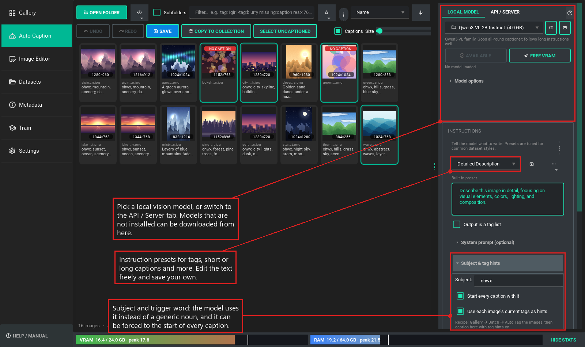

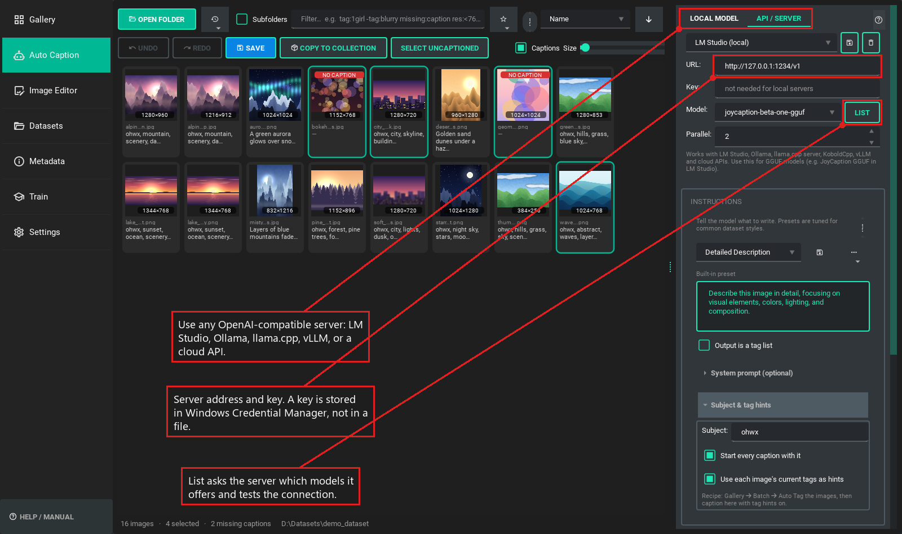

### Image editor

Rotate, flip, resize, crop to a size or aspect ratio, and convert, with a live before/after preview. Edits are saved as copies by default and keep their captions, colour profiles and EXIF.

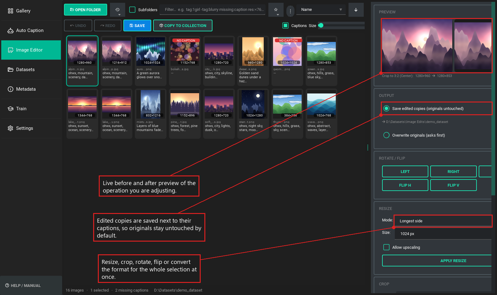

### Collections and export

Gather finished images and captions into training folders, or export a training-ready copy (resized to buckets, cleaned, with kohya-style folder names).

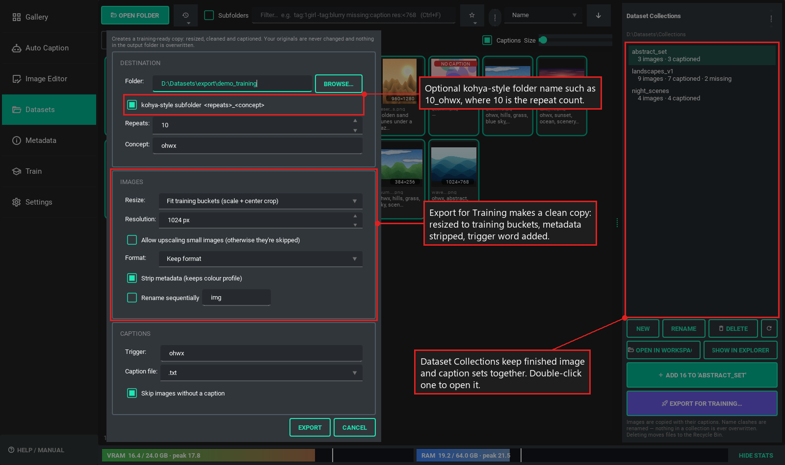

### Metadata tools

A privacy audit (GPS, device serials, AI prompts and workflows), lossless cleanup that never re-encodes pixels, authorship templates, and embedded A1111 / ComfyUI / NovelAI / InvokeAI prompts turned into captions.

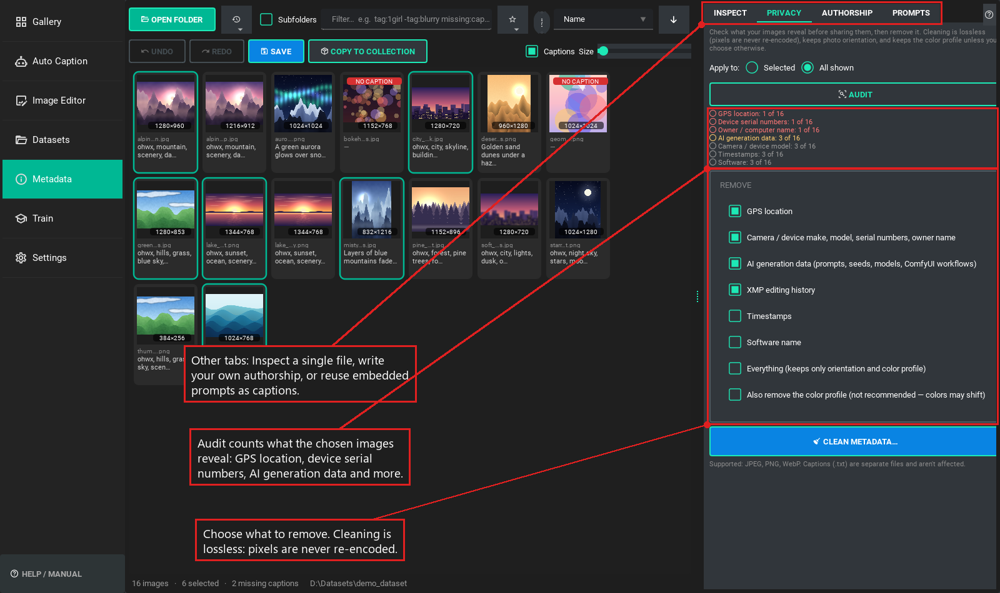

### Native LoRA training

Train on the open dataset with the [Fizgig](https://github.com/shootthesound/Fizgig) trainer's engine, ported into TagScribeR. See [Training a LoRA](#-training-a-lora).

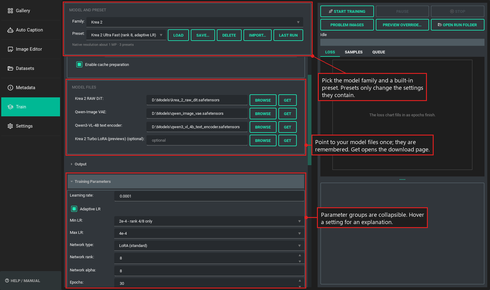

### Built for speed and accessibility

A Ctrl+K command palette, a searchable Help Center (F1 opens help for the current tab), tooltips on every control, and interface scaling up to 200%.

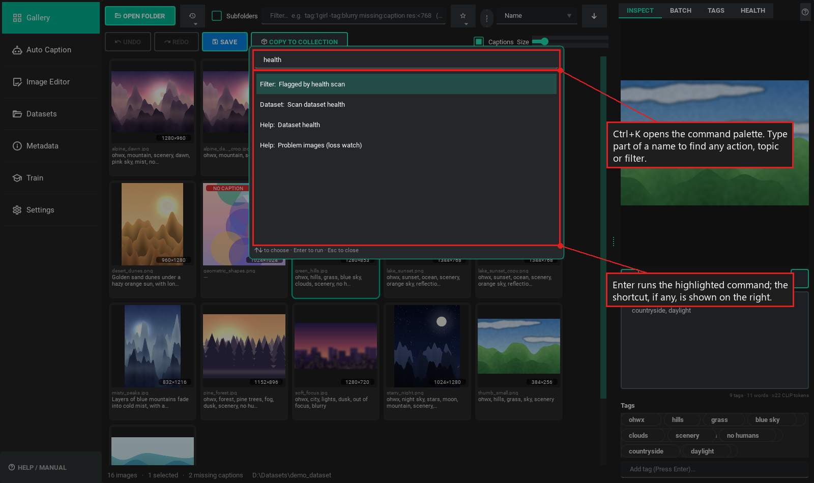

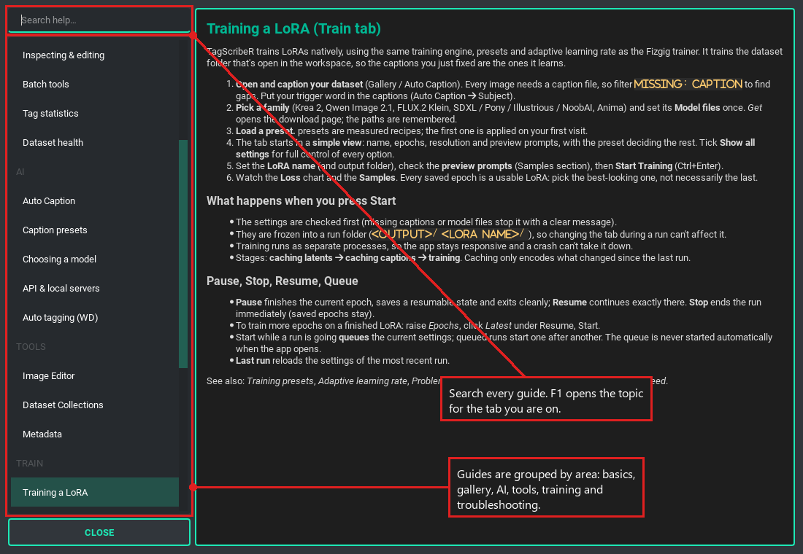

---

## 🚀 Installation

**You need:** Windows 10/11 or Linux, [Python 3.12](https://www.python.org/downloads/), and [Git](https://git-scm.com/).

```cmd
git clone https://github.com/ArchAngelAries/TagScribeR.git
cd TagScribeR
install.bat
```

The installer creates a `venv\` folder, detects your GPU and installs the matching PyTorch build. Then launch with **`start.bat`**.

| Your GPU | What gets installed |
|---|---|
| AMD Radeon on Windows | AMD's native ROCm wheels: `torch 2.12.0+rocm7.15`, built for your exact chip |
| AMD Radeon on Linux | AMD's multi-arch ROCm 7.14 wheels |
| NVIDIA | PyTorch with CUDA 12.8 (RTX 20 to 50 series) |
| None | CPU build |

### AMD Radeon (ROCm)

Supported: RX 7000 and RX 9000 series, Radeon PRO W7000, and Ryzen AI APUs (including Strix Halo). RX 6000 cards are detected but are less tested.

1. Update to a current **AMD Adrenalin** driver.
2. Run `install.bat`. It reads your GPU and picks its architecture (for example `gfx1100` for the RX 7900 series, `gfx1201` for the RX 9070).
3. If it can't tell which GPU you have, pass the architecture yourself:

   ```cmd
   install.bat --arch gfx1100
   ```

Other AMD options:

```cmd
install.bat --no-bnb           :: skip bitsandbytes (8-bit optimizers and 8/4-bit model loading)
install.bat --experimental     :: use AMD's newest, unpinned ROCm nightlies
```

No separate ROCm or HIP SDK install is needed. The app sets the ROCm environment itself when it starts.

bitsandbytes is installed by default. On Windows with an AMD card it is a community ROCm build ([0xDELUXA/bitsandbytes_win_rocm](https://github.com/0xDELUXA/bitsandbytes_win_rocm)), the same pinned wheel the Fizgig trainer uses. It is built by neither AMD nor TagScribeR.

### NVIDIA (CUDA)

1. Update to a current NVIDIA driver.
2. Run `install.bat`. It installs the CUDA 12.8 build of PyTorch.

To force it (for example on a machine with both vendors):

```cmd
install.bat --backend cuda
```

### Linux

```bash
git clone https://github.com/ArchAngelAries/TagScribeR.git
cd TagScribeR
./install.sh        # same options as install.bat
./start.sh
```

On Debian and Ubuntu, Qt also needs `sudo apt-get install libxcb-cursor0`.

### No GPU

```cmd
install.bat --backend cpu
```

Captioning with a local model is slow on CPU. Use the API source in Auto Caption instead (LM Studio, Ollama or a cloud API). Training needs a GPU.

### Updating

Run **`update.bat`**. It pulls the latest code and refreshes dependencies without touching your PyTorch build. Your settings live in `user_data\`, which git never touches.

> **Upgrading from TagScribeR 2.1?** Run `install.bat` again. Your old venv is renamed to `venv-old\` (not deleted), and your settings, quick tags and API presets are imported on first launch. API keys move into Windows Credential Manager. Once you've checked that, delete the old `api_presets.json`, which held them in plain text.

---

## 🧭 Quick start

1. **Open a folder** in the Gallery (Ctrl+O). It opens in every tab.
2. **Caption:**
   - *Auto Caption* for natural-language captions. Pick a model (Download fetches it and shows the size first), choose an instruction preset, press **Caption** (Ctrl+Enter).
   - *Gallery → Batch → Auto tag* for booru-style tags.
3. **Refine** in the Gallery: edit one image in *Inspect*, or many at once in *Batch*.
4. **Save** with Ctrl+S.
5. **Check** the set with *Health*, then **train** it in the *Train* tab.

Press **Ctrl+K** anywhere to find any action, filter or help topic by typing a few letters. Press **F1** for help on the current tab.

Captions are stored the way trainers expect: `image.png` and `image.txt` side by side.

---

## 🎓 Training a LoRA

The Train tab trains the dataset folder you have open. It uses a port of Fizgig's training engine, so it has Fizgig's presets, adaptive learning rate and loss watch.

1. Pick a **family** and set its **model files** once (each row has a *Get* button that opens the download page).
2. Load a **preset**. The ✨ presets are Fizgig's measured recipes. You can save your own, and Fizgig preset files import as they are.
3. Set the **LoRA name**, check the preview prompts, and press **Start Training**.

The tab opens in a simple view with only the essentials. Tick **Show all settings** to control every option.

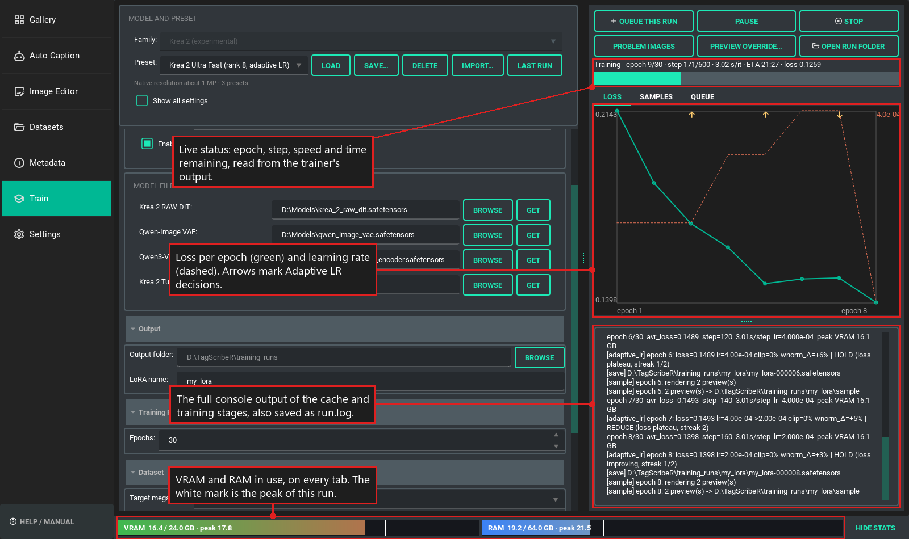

What you get while it runs:

- **Adaptive learning rate.** You give a minimum and maximum; it probes up while the loss improves, backs off on a plateau, and rolls back if training turns unstable.
- **Sample previews** after each epoch, rendered with the LoRA so far. Every saved epoch is a usable LoRA.
- **Problem Images.** A loss watch flags images that never learn. Fix the caption in the window and the run picks it up at the next epoch. It can also re-caption stuck images for you.
- **Pause and resume** at any epoch, a **run queue**, and resumable state for training more epochs later.
- **Automatic memory planning.** It picks a base precision (bf16, 8-bit or 4-bit) and block swapping from your free VRAM.

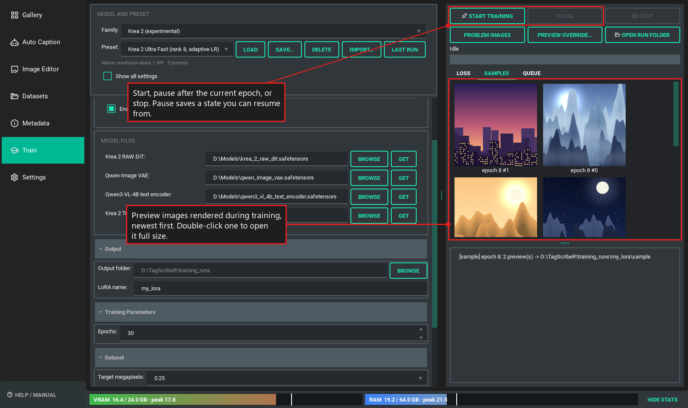

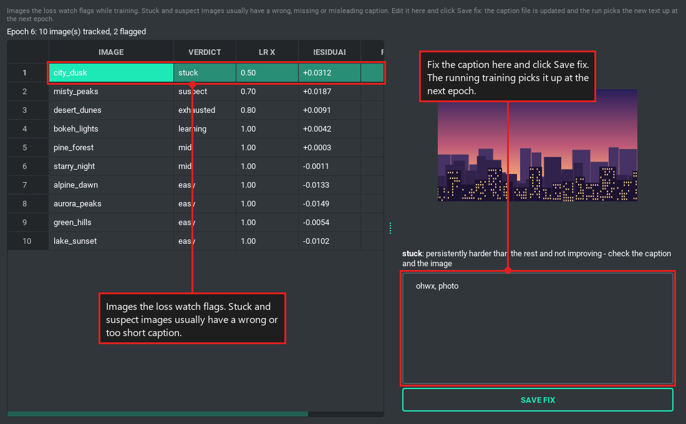

Training runs as separate processes, so the app stays responsive and a crash can't take it down. Each run lives in its own folder: `<output folder>\<LoRA name>\` with checkpoints, `sample\`, `loss_log\` and `run.log`.

### Model families

| Family | Recipe |
|---|---|
| Krea 2 | Fizgig's presets and measured settings |
| Qwen Image 2.1 (including edit LoRAs from before/after pairs) | Fizgig's presets and measured settings |
| MiniMax H3 (still images only) | Fizgig's presets |
| FLUX.2 Klein Base 9B | Fizgig's presets, with Model Area block targeting |
| SDXL 1.0, Pony Diffusion V6 XL, Illustrious-XL, NoobAI-XL (eps and v-pred) | Community starting points |
| Anima | Community starting points |

Training is new and every family is marked experimental until it has been proven on real runs. Fizgig has no code
for the SDXL family or Anima, so their presets are community starting points, not measured recipes. Model weights
are not included and have their own licences.

---

## 🛡️ Your data is safe

- **Atomic saves with backups.** The first version of every caption overwritten each day is copied to `user_data\caption_backups\<date>\`.
- **Deletes go to the Recycle Bin.** Copies never overwrite; name clashes get a ` (2)` suffix.
- **Image edits default to copies** in `Image Edits\`.
- **API keys** are kept in Windows Credential Manager (or your OS keychain), not in files.
- **Local by default.** Images are only sent anywhere if you choose an API source.

---

## 🔧 Troubleshooting

- **Logs:** `user_data\logs\tagscriber.log`. *Settings → System & diagnostics* shows the detected GPU and library versions (*Copy report* for bug reports).
- **Recovering a caption:** look in `user_data\caption_backups\<date>\`.
- **First image is slow (about 20 s) on AMD:** one-time kernel selection after a model loads. Later images take about a second.
- **Qwen3.5 logs "falling back to its reference PyTorch implementation":** expected on ROCm. Output is correct. Use batch size 2 to 4, or Qwen3-VL for top speed.
- **Out of GPU memory:** lower *Max image size*, use a smaller model, or close ComfyUI / Forge, which keep models in VRAM. A failed batch is retried one image at a time.
- **Training falls back from AdamW 8-bit to AdamW:** bitsandbytes is missing. Run `update.bat`, which installs it.
- **A model says it needs custom code:** enable *Allow custom model code* in Model options, but only for sources you trust.
- **`install.bat` can't find Python 3.12:** install it from python.org (or `py install 3.12`) and run the installer again.

Developer notes: [docs/ARCHITECTURE.md](docs/ARCHITECTURE.md). Run the tests with `venv\Scripts\python -m pytest`.

---

## 🤝 Credits and licence

- **Training engine:** ported from [Fizgig](https://github.com/shootthesound/Fizgig) (Apache-2.0, © 2026 Peter Neill), whose ROCm stack the environment also follows. See [THIRD_PARTY_NOTICES.md](THIRD_PARTY_NOTICES.md).
- **GUI:** [PySide6](https://pypi.org/project/PySide6/), [qt-material](https://pypi.org/project/qt-material/), [QtAwesome](https://github.com/spyder-ide/qtawesome).
- **AI backend:** [Hugging Face Transformers](https://huggingface.co/docs/transformers/index), [ONNX Runtime](https://onnxruntime.ai/), [WD Taggers](https://huggingface.co/SmilingWolf).
- **AMD support:** [ROCm for Windows](https://github.com/ROCm/TheRock).

**Licence:** TagScribeR is free software under the [GNU General Public License v3.0](LICENSE). Use it, change it and share it freely; if you redistribute it or a modified version, keep the source open under the same licence. The licence covers the program only: the LoRAs, captions and images you make with it are yours. Code adapted from other projects keeps its original notices in [THIRD_PARTY_NOTICES.md](THIRD_PARTY_NOTICES.md). Model weights are not included and have their own licences.

Created by **ArchAngelAries**. Code assisted by Google's Gemini and Anthropic's Claude.
